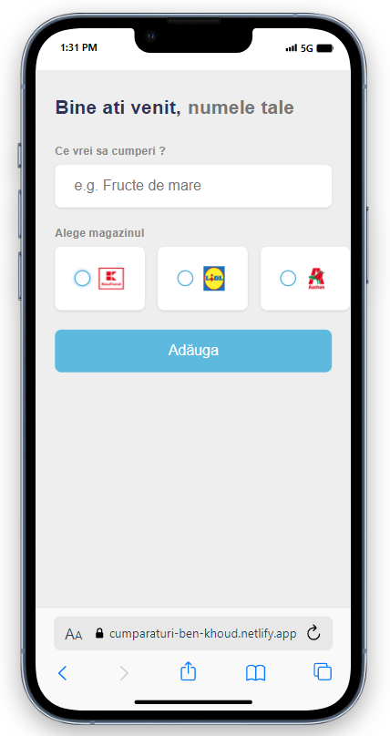
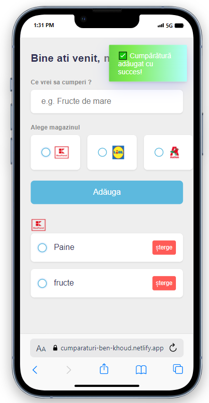
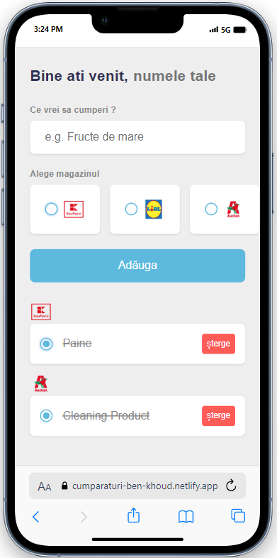
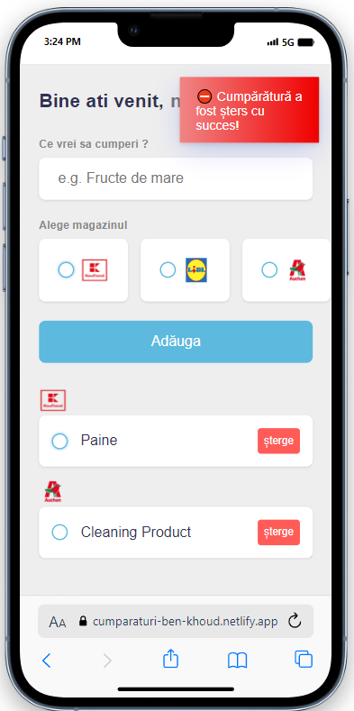

# Todo mini-project learning vue js

## [Click Here to try live demo](https://cumparaturi-ben-khoud.netlify.app/)

# Concept

Todo shopping app implemented in order to learn vueJs while the app remains for daily usage.

# Technologies used 🛠️

- [Vite](https://vitejs.dev/)
- [Vue](https://vuejs.org/)
- [Toastify](https://github.com/fkhadra/react-toastify)

    
    
    
    

